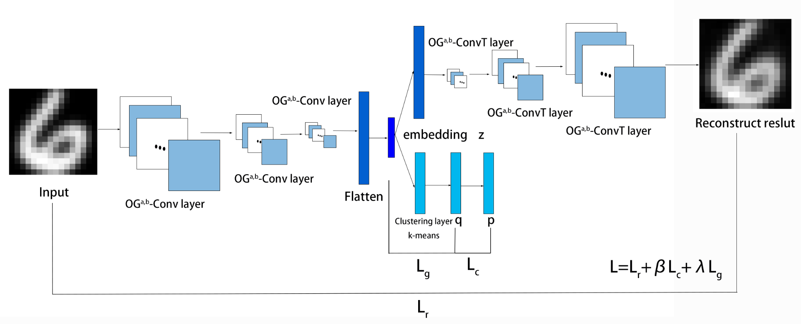

# Deep Convolutional Embedded Clustering With OG-functions and Manifold Regularization（OGMR-DCEC）

By Zhiwei Xing , Xiaotong Qin , Yingcang Ma , Xiaofei Yang and Yonghua Mao

This is a Python code implementation of the paper.

## Dependency
- tensorflow==2.20.0
- keras==3.13.2
- numpy==2.3.5
- scipy==1.17.0
- scikit-learn==1.8.0
- h5py==3.15.1

## Configuration
In the folder with the corresponding dataset name, there is a pre-trained weight h5 file for the corresponding dataset, which can be loaded and used directly.